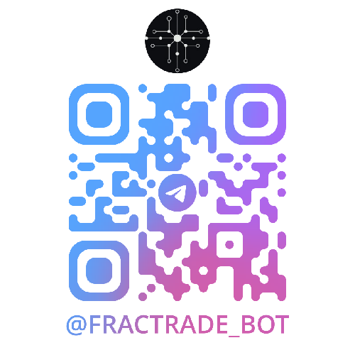

# Fractrade Telegram Bot

The Fractrade Telegram Bot is a bot that allows you to interact with your agents on fractrade.xyz. It is a simple bot that allows you to subscribe to your agents and receive trading signals / updates in your Telegram chat. This is useful if you want to be notified about new trading opportunities, receive for example risk warnings about your portfolio, customized news or other information. If you use Telegram trading bots or Telegram as information source, it might be useful to use the bot, but its not required.

More features will be added in the future.

## Bot details

Bot Name: fractrade.xyz
Bot Username: @fractrade_bot

Or you can scan this QR code:

## Bot commands

The bot supports the following commands:

- ### /start
  Initiates interaction with the bot and displays welcome message with basic instructions.

- ### /help
  Displays a help message with all available commands and their descriptions.

- ### /subscribe <agent_token_id>
  Subscribes you to the agent with the given token id. You can find the token id in the agent summary page in the Fractrade app. Just press the "eye" icon in the agent overview to see the token id. When subscribing to an agent, you will receive all trading signals and updates from the agent in your Telegram chat. You can subscribe to multiple agents at the same time and also subscribe with multiple accounts.

- ### /unsubscribe <agent_token_id>
  Unsubscribes you from the agent with the given token id.

- ### /list
  Lists all your agents subscriptions including the tokens.

